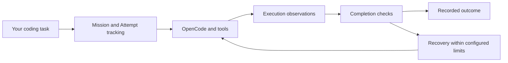

# Chaos Harness

**An experimental AI coding agent harness for OpenCode — execution traces, completion checks, and bounded failure recovery.**

[](https://github.com/huisezhiyin/chaos-harness/actions/workflows/preview.yml)
[](https://github.com/huisezhiyin/chaos-harness/releases/tag/v0.1.0-alpha)
[](LICENSE)

English | [简体中文](README.zh-CN.md)

[Quick start](#quick-start) · [How it works](#how-it-works) · [Evaluation](#evaluation-and-current-limits) · [Report an issue](https://github.com/huisezhiyin/chaos-harness/issues/new/choose)

Chaos Harness runs coding tasks in your Git repository through OpenCode. It records what the agent did, checks evidence before accepting completion, and controls recovery within configured limits. It is for developers experimenting with agentic coding and researchers studying coding agent reliability, tool execution, and failure recovery.

**v0.1.0-alpha is available as a source release.** The validated setup is macOS, Node.js 22, pnpm 11.6.0, OpenCode 1.18.27, and DashScope Qwen. Bring your own model credentials. There is no published npm package.

## What you can do

- **Run small coding tasks:** add regression tests, investigate a reproducible bug, or make a scoped change in a repository you can review.
- **Inspect agent execution:** track Missions (tasks), Attempts, tool actions, and termination reasons.
- **Check completion evidence:** inspect post-change validation and change checks; callers can supply an independent acceptance verifier.
- **Study bounded recovery:** recover within configured limits while retaining failed outcomes for analysis.
- **Control the runtime environment:** separate Host caches from task temporary files and check tool working directories and loaded plugins.

## How it works



OpenCode provides the execution interface. Chaos Harness manages the task lifecycle, gathers evidence, and applies completion and recovery rules. You review the resulting diff and tests.

## Quick start

Install **Node.js 22**, **pnpm 11.6.0**, and **OpenCode 1.18.27** on macOS first.

```sh
git clone https://github.com/huisezhiyin/chaos-harness.git
cd chaos-harness
pnpm install --frozen-lockfile
pnpm check
```

`pnpm check` runs type checks, product tests, and preview checks without model credentials or remote model calls. `main` contains current development; the [Alpha tag](https://github.com/huisezhiyin/chaos-harness/releases/tag/v0.1.0-alpha) identifies the published snapshot.

Create a private configuration file such as `~/.config/chaos-preview.env` with your own provider settings:

```dotenv
DASHSCOPE_BASE_URL=https://dashscope.aliyuncs.com/compatible-mode/v1
DASHSCOPE_MODEL=qwen3.8-max
DASHSCOPE_API_KEY=YOUR_API_KEY
```

Run these commands from the Chaos Harness source directory:

```sh
chmod 600 ~/.config/chaos-preview.env
node bin/chaos-preview.mjs --env-file ~/.config/chaos-preview.env --check-profile
node bin/chaos-preview.mjs --env-file ~/.config/chaos-preview.env --root /path/to/your/git-repository
```

`--check-profile` checks local configuration only. Submitting a task in the interface calls your model provider and may incur charges. Start with a small repository you know and a task such as:

> Add regression tests for empty input and boundary values in this function. Run the relevant tests and explain the diff. Keep unrelated behavior unchanged.

See the [detailed setup guide (中文)](PREVIEW.md) for runtime paths, configuration, and the optional local Host check. The default state directory is `~/.local/state/chaos-harness/`.

## Evaluation and current limits

The source preparation passed type checks, **600 product tests**, **14 preview checks**, and **2 OpenCode Host checks using local fixed responses**, with no remote model calls. [CI](https://github.com/huisezhiyin/chaos-harness/actions/workflows/preview.yml) runs the type, product, and preview checks on macOS.

Two maintenance-task batches completed **6 of 8 tasks end to end**. They used different runtime versions; this is not a comparable benchmark score. The two original failures remain recorded. We have not established an advantage over other coding agents, and external first-use validation is still pending. See the [evaluation summary (中文)](docs/evaluation-status.md).

- Completion checks cover configured evidence; the default interface does not include an independent business-correctness verifier for arbitrary requests. Review the diff and run your project's tests.
- Working-directory and environment checks are not an operating-system sandbox.
- Linux, Windows, other model configurations, and the Codex fallback are outside this Alpha's validated scope.
- Historical evaluation scripts depend on specific inputs and private evidence. Use `pnpm check` for development; do not rerun frozen batches as a general test suite.

## Contribute and explore

Try a small task and [report your experience](https://github.com/huisezhiyin/chaos-harness/issues/new/choose), including your commit, environment versions, expected behavior, actual outcome, and a sanitized error summary. Never include credentials or raw private logs.

- [中文 README](README.zh-CN.md) and [first-use checklist (中文)](docs/alpha-trial.md)
- [Contribution guide (中文)](CONTRIBUTING.md) and [security reporting](SECURITY.md)
- [Module overview (中文)](ARCHITECTURE.md) and [project scope (中文)](PROJECT_SPEC.md)
- [Source sanitization scope (中文)](docs/public-source.md) and [third-party notices](THIRD_PARTY_NOTICES.md)

## License

[MIT](LICENSE). OpenCode, model providers, and third-party dependencies retain their own licenses and terms.
